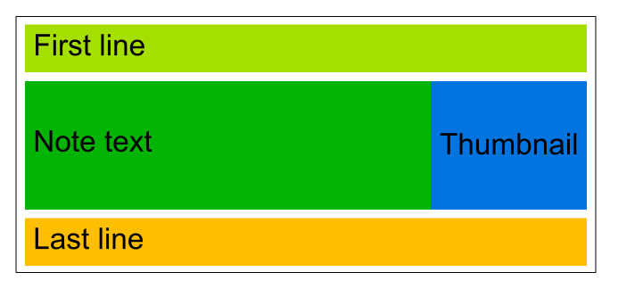
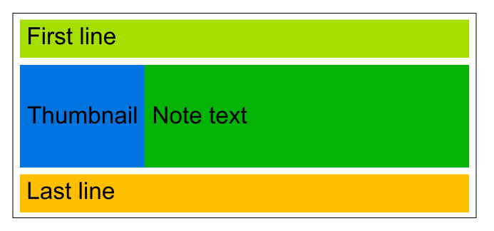
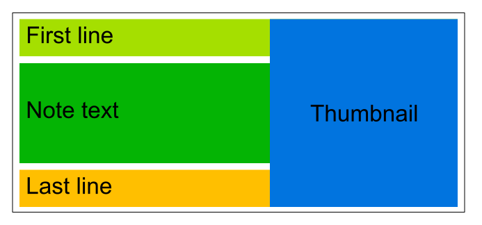
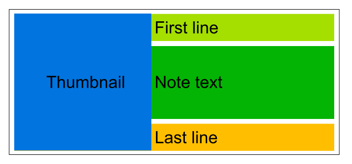

<!-- markdownlint-disable MD033 -->
<!-- markdownlint-disable MD028 -->
<!-- markdownlint-disable MD007 -->
<!-- markdownlint-disable MD045 -->

# Joplin Plugin: Note list (Preview) 

A plugin to add a preview to the Joplin note list.

<!-- prettier-ignore-start -->

<!-- TOC depthfrom:2 orderedlist:false -->

- [Installation](#installation)
    - [Automatic](#automatic)
    - [Manual](#manual)
- [Usage](#usage)
- [Plugin options](#plugin-options)
- [Layouts](#layouts)
    - [Layout 1](#layout-1)
    - [Layout 2](#layout-2)
- [Examples with settings](#examples-with-settings)
    - [Date and Tags](#date-and-tags)
    - [Thumbnail right](#thumbnail-right)
    - [Square Thumbnail](#square-thumbnail)
- [FAQ](#faq)
- [Confidential notes](#confidential-notes)
- [Changelog](#changelog)

<!-- /TOC -->

<!-- prettier-ignore-end -->

## Installation

### Automatic

- Go to `Tools > Options > Plugins`
- Search for `Note list (Preview)`
- Click Install plugin
- Restart Joplin to enable the plugin

### Manual

- Download the latest released JPL package (`io.github.jackgruber.notelistpreview.jpl`) from [here](https://github.com/JackGruber/joplin-plugin-notelistpreview/releases/latest)
- Close Joplin
- Copy the downloaded JPL package in your profile `plugins` folder
- Start Joplin

## Usage

The new note list view can be activated under `View > Note list style > Preview`.

## Plugin options

Settings for the plugin, accessible at `Tools > Options > Note overview`.
Joplin must be restarted after changing settings!

## Layouts

### Layout 1

| Thumbnail | Preview                                         |
| --------- | ----------------------------------------------- |
| Right     |  |
| Left      |  |
| No        |        |

### Layout 2

| Thumbnail | Preview                                         |
| --------- | ----------------------------------------------- |
| Right     |  |
| Left      |  |
| No        |        |

## Examples with settings

### Date and Tags

| Setting      | Value    |
| ------------ | -------- |
| Note excerpt | 115      |
| Last line    | {{tags}} |

### Thumbnail right

| Setting      | Value |
| ------------ | ----- |
| Thumbnail    | Right |
| Note excerpt | 100   |

### Square Thumbnail

| Setting        | Value    |
| -------------- | -------- |
| Layout         | Layout 2 |
| Thumbnail      | Right    |
| Item height    | 95       |
| Thumbnail size | 85       |

## FAQ

## Confidential notes

Notes can be marked as confidential using tags or the context menu.
The tags witch mark the note confidentiality must be configured in the plugin settings.

## Changelog

See [Changelog](CHANGELOG.md)
